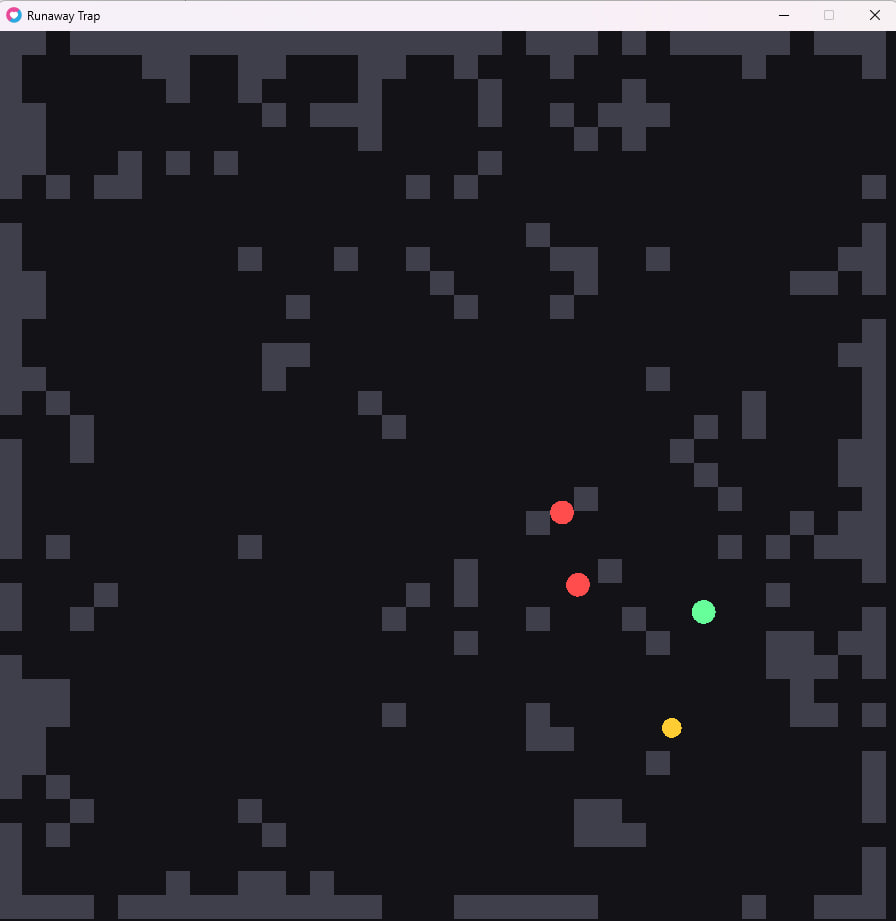

# Runaway Trap 
A fast-paced 2D action game built with **Love2D** and **Lua** using a lightweight **Entity-Component-System (ECS)** approach.  
You play as a green runner, chased by red enemies. Lure them into a yellow rotating trap. 

---

## Features
- **ECS-style architecture:** small, focused components and systems.
- **Procedural walls** (Voronoi-inspired) with passages.
- **Chasing enemies** with simple AI.
- **Rotating trap** that leaves a visible trail; enemies die on contact.
- **Minimalist visuals** with clear color coding (player = green, enemies = red, trap = yellow).
