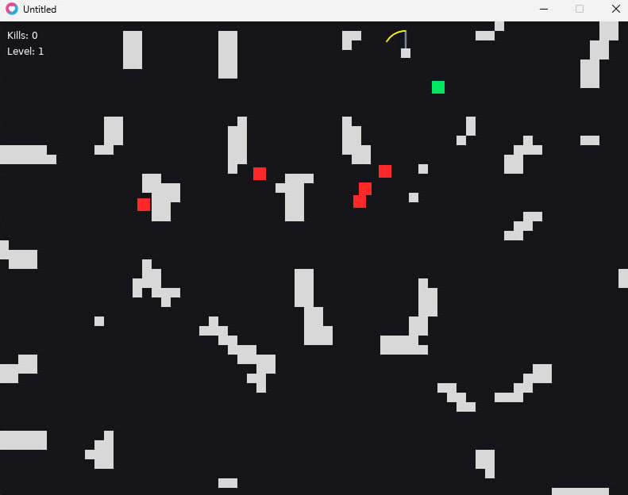

# Runaway Trap 
A fast-paced 2D action game built with **Love2D** and **Lua** using a lightweight **Entity–Component–System (ECS)** approach.  
You play as a green runner, chased by red enemies. Lure them into a rotating trap. 



---

## Features
- **ECS-style architecture:** small, focused components and systems.
- **Procedural walls** (Voronoi-inspired) with passages.
- **Chasing enemies** with simple AI.
- **Rotating trap** that leaves a visible trail; enemies die on contact.
- **Level progression** and kill counter HUD.
- **Minimalist visuals** with clear color coding (player = green, enemies = red).

---

## Requirements
- **Love2D 11.x** (recommended 11.5) — Windows / Linux / macOS

---

## How to Run

### Terminal
1. Install Love2D.
2. Clone or extract the project.
3. From the project folder run:
   ```bash
   love .
